# Tutorial
Here we present one workflow of how to use the plugin `ltex-utils.nvim` showcasing its features.

**Table of Contents**

1. [Code Actions](#code_actions)
    * [Keybindings in `modify_dict` Telescope window](#keybindings_in_`modify_dict`_telescope_window)
2. [Updating custom dictionaries](#updating_custom_dictionaries)

## Code Actions
Let us open the [`README.md`](README.md) file of this repository.
When opening a file for the first time, we get a warning that no settings file exist yet.

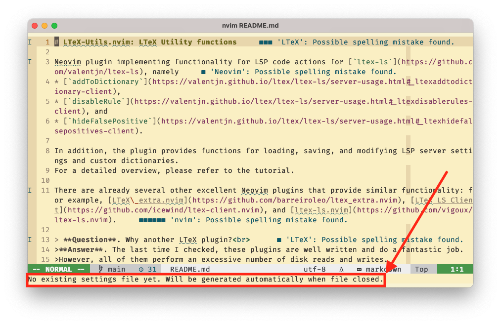

By typing `]d` and `[d` we can cycle through the different issues that LTeX has found.
The first issue in our case is a possible spelling mistake.
Go with the cursor to the place indicated in the picture below:

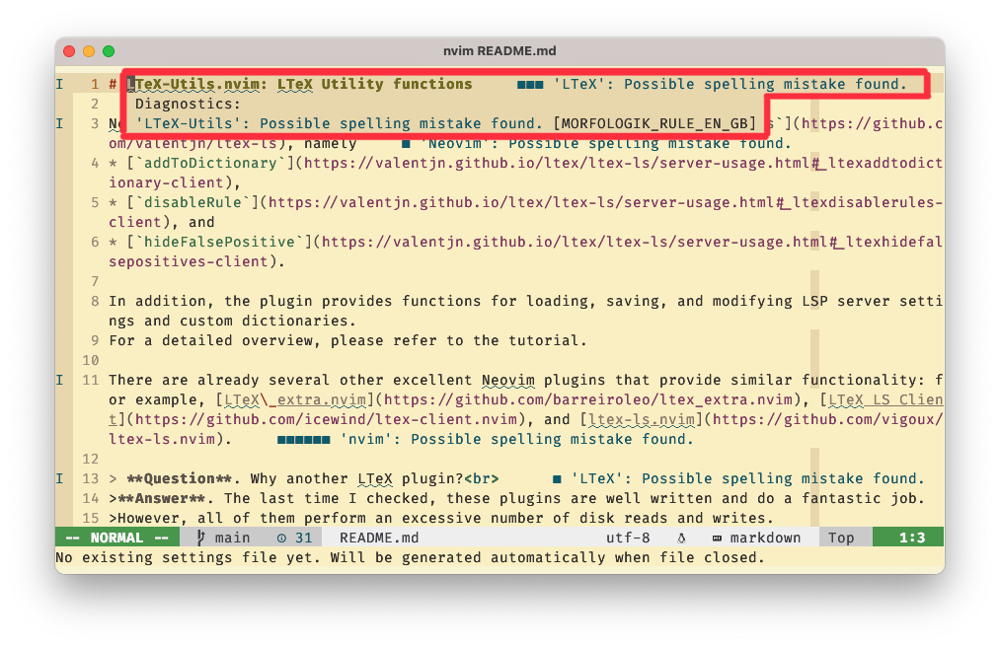

Type `<leader>-ca` to activate code actions.

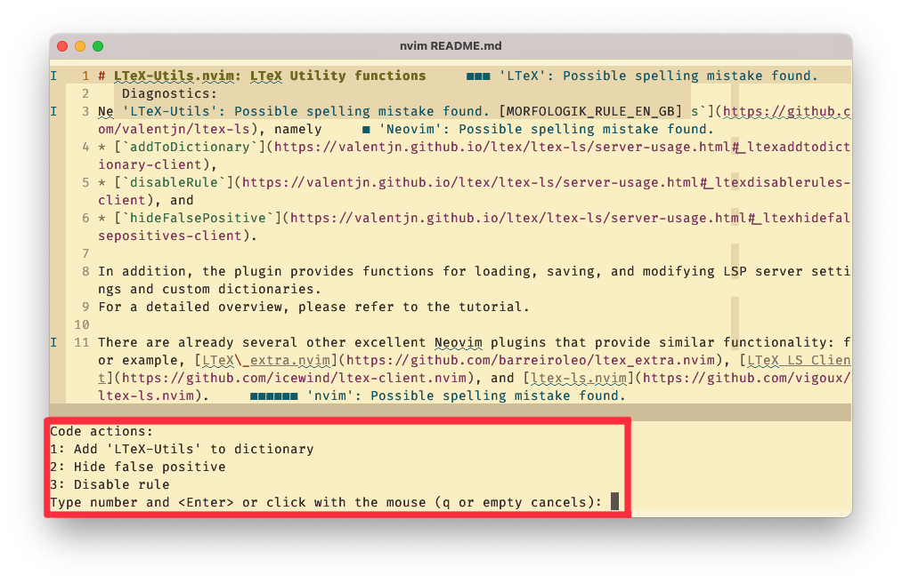

## Updating custom dictionaries
Let's say we want to add 'LTeX-Utils' to our dictionary, so press **1**.
Do the same for 'nvim' and 'LTeX' (that is, press `]d` to go to next issue and then press `<leader>-ca` to open code actions).

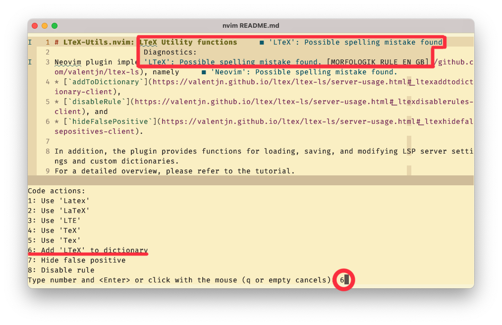

To check which words are contained in our dictionary use the command `:LTeXUtils modify_dict`.

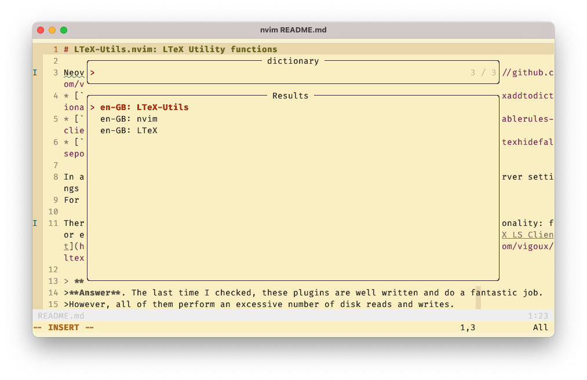

This is a Telescope window where you can fuzzy search for words.
To change the selected word, press `<cr>`.
This opens a popup window with the word.

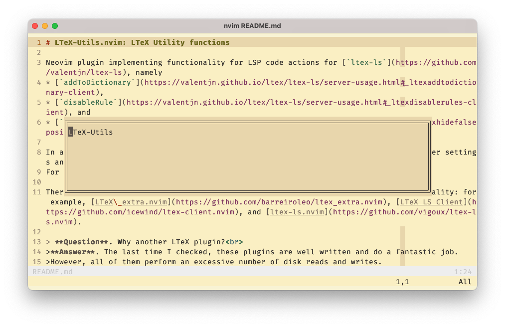

Here you can use your usual editing tools to modify the word.
Say we want to make 'Utils' lowercase.
When you are done editing the word confirm the changes by pressing `<cr>`.
You can abort the whole process via the command `:q`.

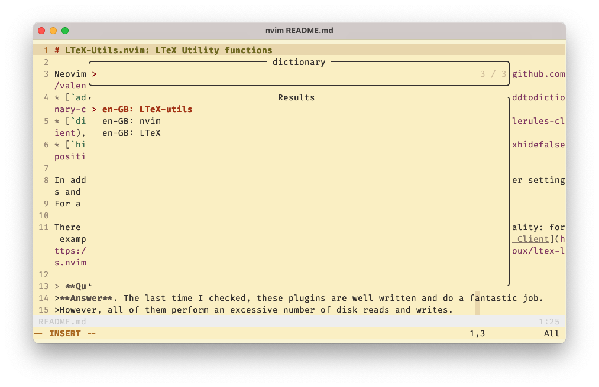

Finally, if you change your mind and don't want 'LTeX-utils' to be part of your custom dictionary, then you can delete it by pressing `d` in **normal mode**.

### Keybindings in `modify_dict` Telescope window
| mode          | key    | description                     |
|---------------|--------|---------------------------------|
| normal        | `d`    | deletes selected entry          |
| insert/normal | `<cr>` | opens popup window to edit word |

Please note `d` and `<cr>` are the standard keybindings and can be overwritten by custom configuration.
See the [Configuration](README.md#installation) Section in [README](README.md).

## Hide False Positives

Each issue flagged up by LTeX can be hidden using the `hideFalsePositives` code action.
This adds a rule to the settings of the LSP server to hide all issues in a specified sentence.
Sentences can be specified explicitly or via [regular expressions](https://valentjn.github.io/ltex/advanced-usage.html#hiding-false-positives-with-regular-expressions).

For example, when we go to the [Installation](README.md#installation) Section we see the issue 'This sentence does not start with an uppercase letter.'.
This is a good example of a false positive as `lazy.nvim` is a name that starts with a lowercase letter.

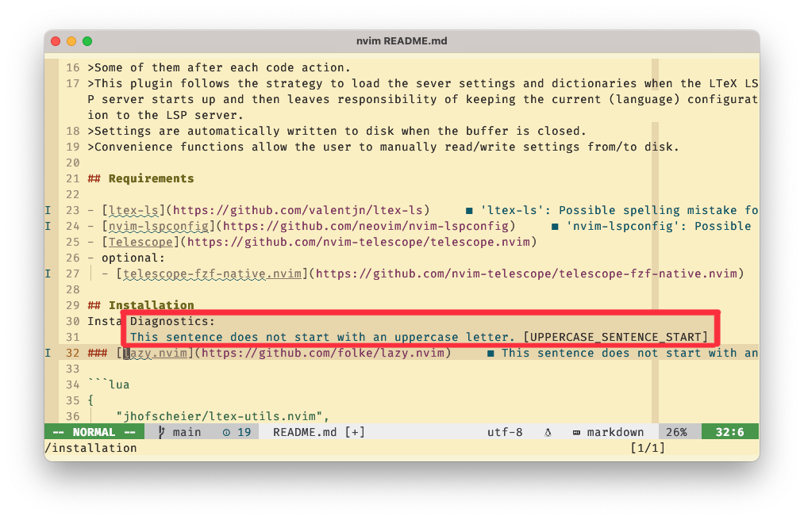

We can hide this issue by opening code actions `<leader>-ca` and then selecting the respective option.
We practice a little more by hiding further false positives.
Let's suppose we go to the following issue in the [README.md](README.md).

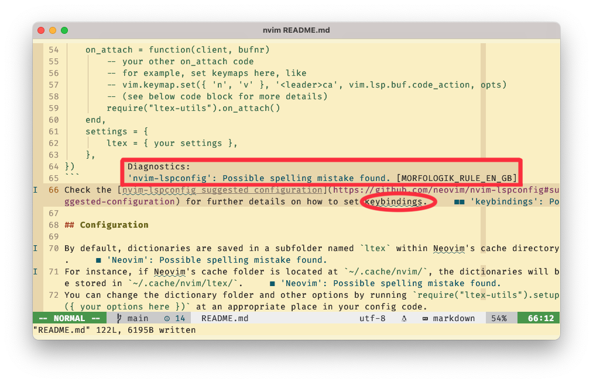

Notice that there are 2 issues in this sentence, and we have selected the first issue.
Let's hide the 'Possible spelling mistake found.' issue by executing the code action `hideFalsePositives`.
Notice that the second issue in this sentence also disappears.
It's worth mentioning that adding a rule for a false positive will hide all issues of a sentence.
Therefore, I recommend using 'hide false positives' code actions frugally.
(Here by 'sentence' we mean in the sense of how LanguageTool defines the notion of sentences.
In most cases this coincides with our understanding of 'sentence', but not always.)

Let us suppose that we changed 'lazy.nvim' to 'packer.nvim' in the text.
Then the rule to hide 'lazy.nvim' is outdated, and we need to add another `hideFalsePositives` rule to hide 'packer.nvim'.
However, now we have the problem that the LSP server now contains 'inactive' or 'obsolete' `hideFalsePositives` rules.
This is another reason why hiding false positives should be done with great care.
However, this plugin provides tools that greatly facilitate managing false positives.

Let us inspect the rules of the LSP server by executing the command `:LTeXUtils modify_hiddenFalsePositives` which opens a Telescope window with the available `hideFalsePositives` rules.

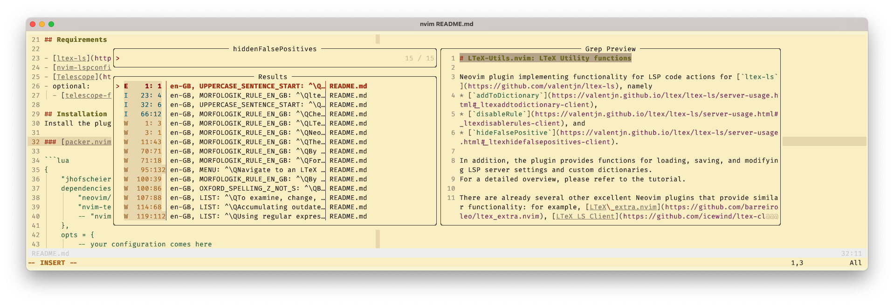

On top of the list (marked as an error) are the 'inactive' or 'obsolete' `hideFalsePositives` rules.
You can either delete them one-by-one by selecting them and then pressing `d` in **normal mode**.
Alternatively, you can press `c` in **normal mode** which will execute a 'cleanup' that will delete all 'obsolete' rules.

Furthermore, notice that right after the 'obsolete' rules come the active rules that have been added via executing the code action.
Rules marked as warnings are available rules that haven been added to the LSP server settings via code actions.

You can modify the selected rule by pressing `<cr>` which opens a popup window with the respective rule.
To accept the changes press `<cr>` again which brings you back to the Telescope window.
Like above use `:q` in the popup window to abort the whole process.
Notice that the order of the rules is preserved, however modified rules are marked as hints.

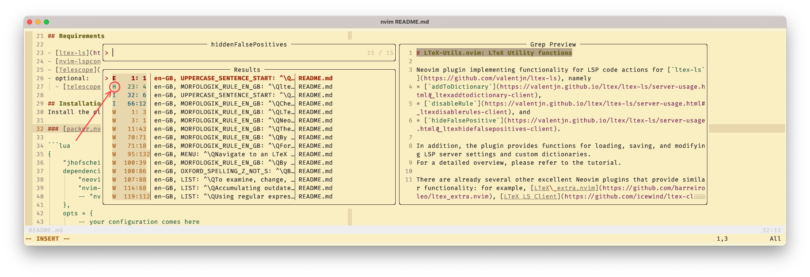

Finally, you can quickly navigate to the specific line and column in the text where the issue is located (corresponding to the selected entry) by pressing `g` in **normal mode**.

### Keybindings in `modify_hideFalsePositives` Telescope window
| mode          | key    | description                                                                                                 |
|---------------|--------|-------------------------------------------------------------------------------------------------------------|
| normal        | `d`    | deletes selected entry or entries. One can select more entries using the `<tab>` key.                       |
| normal        | `c`    | deletes all 'inactive' rules, that is, perform a cleanup of rules list.                                     |
| normal        | `g`    | jumps to the respective line and column where the issue can be found that corresponds to the selected entry |
| insert/normal | `<cr>` | opens popup window to edit word                                                                             |

# Disable Rules
`disableRules` code actions allow us to disable more general language rules, such as `[OXFORD_SPELLING_Z_NOT_S]`.
In order to add, delete, or modify these rules follow the instructions given in the Section [Hide False Positives](#hide_false_positives).
Also, keybindings in the Telescope window are identical.

